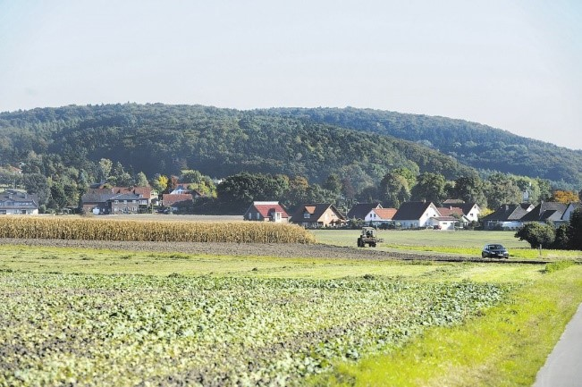
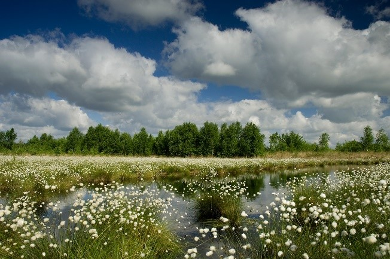
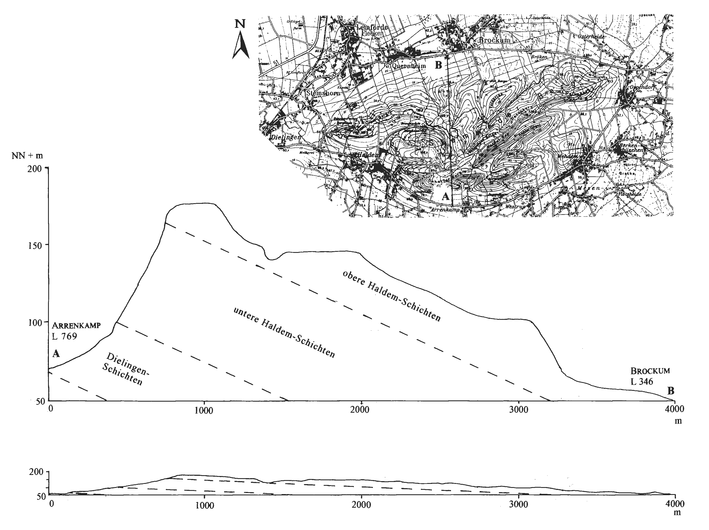
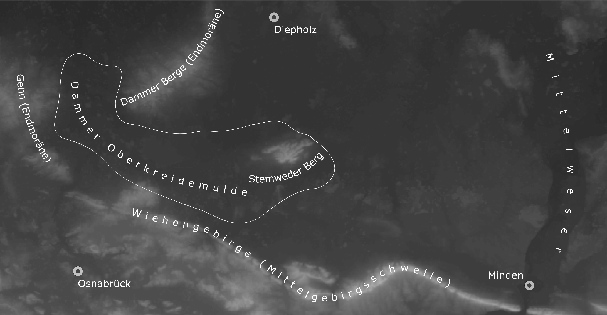
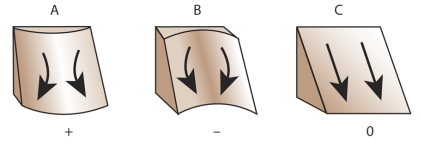
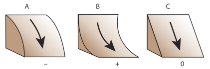

# Excersice - Arbeiten mit Rasterdaten

## Task
* Install plugins in QGIS
*	Use the World Heritage in Danger data set
*	Create a cartogram
*	Add a WMTS layer

## Data:
* GeoTIFF „tandem_x_dem“ (Quelle: [Deutsches Zentrum für Luft- und Raumfahrt (DLR)](https://download.geoservice.dlr.de/TDM90/))
* UNESCO List of World Heritage in Danger (Source: https://whc.unesco.org/en/danger/, Copyright © 1992 - 2021 UNESCO/World Heritage Centre. All rights reserved)
* 

Ladet euch [die Daten herunter](abgabe_04_data.zip) und speichert sie auf eurem PC. Legt einen lokalen Ordner (nicht auf einem Netzlaufwerk wie zum Beispiel "Q://Abgabe") an und speichert dort die obigen Daten. (.zip Ordner müssen vorher entpackt werden.)

## Abzugeben sind:
* Ein GeoTIFF “ausschnitt” (Aufgabe 1)
* Ein GeoTIFF “planform_curvature” (Aufgabe 2)
* Ein GeoTIFF “profile_curvature” (Aufgabe 2)
*	Ein GeoTIFF “slope” (Aufgabe 3)
*	Ein GeoTIFF “final_result” (Aufgabe 4)
*	Führt diese Dateien in einen ZIP-Ordner zusammen. Ladet diesen final auf Moodle hoch.
* Hinweis 1: Abgaben ohne Dokumentation (als PDF) werden mit 0 Punkten bewertet!

Hinweise für die Dokumentation:
* gebt alle wesentlichen Schritte kurz und knapp an
* Stichpunkte genügen (bitte keine Romane! ;))
* Bitte gebt auf jeden Fall den Namen der Tools an, welche ihr genutzt habt
* falls ihr Parameter gewählt habt, nennt diese und liefert eine kurze Begründung, wenn der Parameterwert nicht eindeutig in der Aufgabenstellung gegeben war
* für Abgabe 04 sollte eure Dokumentation (ohne Screenshots) ungefähr 1-2 A4 Seite lang sein

## Kontext
Die in der norddeutschen Tiefebene gelegene Dammer Oberkreidemulde besteht aus Ablagerungen der oberen Kreidezeit, welche von tertiären und pleistozänen Sedimenten toniger Natur überdeckt sind. Das Gebiet besteht aus zwei Teilen: der flachen, muldenartigen Landschaft zwischen den Orten Bersenbrück, Bramsche, Damme und Stemwede; sowie dem östlich anstehende Stemweder Berg. Ersteres Gebiet ist noch heute von den tertiären und pleistozänen Ablagerungen geprägt. Der kleine Gebirgsstock des Stemweder Berges bildet die östliche Ausstreichung der kreidezeitlichen Gesteinsschichten, welche durch Reliefumkehr freigelegt wurden. Der Stemweder Berg ist der einzige nicht-eiszeitliche Gebirgsstock nördlich der Mittelgebirgsschwelle. Untenstehend finden Sie einige Illustrationen des besprochenen Gebietes:

*Stemweder Berg (links), Oppenweher Moor in der Dammer Oberkreidemulde (rechts)*

*Querschnitt des Stemweder Berges (im Querschnitt: links = Osten, rechts = Westen).*

Die Aufgabe dieses Übungsblattes besteht in der Ermittlung von Flächen, die in besonderem Maße von Erosion bedroht sind. Norddeutschland und damit auch das betrachtete Gebiet ist in besonderem Maße von Nitratbelastung in Gewässern betroffen. Erosion trägt hier zusätzlich bei, indem landwirtschaftlich genutzte Flächen in Hanglage abgetragen und Nährstoffe in Gewässer eingetragen werden. Besonders betroffen ist der Dümmer See, welcher am Nordrand der Dammer Oberkreidemulde liegt. Folgende Abbildung basiert auf einem SRTM-Höhenraster und bietet Ihnen einen Überblick:

*Überblick über die geographische Einbettung der Dammer Oberkreidemulde.*

## Aufgaben

### Aufgabe 1 (15 Punkte)
Extrahiert das Gebiet der Dammer Oberkreidemulde inklusive der umliegenden Höhenzüge (Gehn, Stemweder Berg, Dammer Berge, direkt südlich angrenzender Teil des Wiehengebirges) aus dem Gesamtdatensatz (TANDEM-X-Höhenraster). Erstellt dabei einen rechteckigen Ausschnitt. Stellt sicher, dass die Daten in einer geeigneten Projektion vorliegen (UTM 32N).

### Aufgabe 2 (35 Punkte)
Berechnet die lokalen Geländekrümmungen (Curvature) für den in Aufgabe 1 extrahierten Ausschnitt. Ermittelt hierbei zwei Arten der Geländekrümmung (siehe untenstehende Abbildung):

* a) Profilkrümmung (englisch: profile),
* b) Horizontalkrümmung (englisch: planform/plan).

Eine positive Profilkrümmung gibt eine konkave Krümmung an, was die Fließgeschwindigkeit von abfließendem Wasser erhöht. Bei der horizontalen Krümmung sind hingegen negative Werte von größerer Bedeutung für die Erosion, da dies Wasserflüsse bündelt und so die Fließgeschwindigkeit und den Bodenabtrag noch stärker beschleunigt.

* Speichert eure Ergebnisse als GeoTIFF-Dateien.

*Horizontale Krümmung (links), Profilkrümmung (rechts)*

### Aufgabe 3 (15 Punkte)
Berechnet die Geländeneigung (Slope) in Grad für das extrahierte Gebiet. Speichert diese ebenfalls in ein GeoTIFF.

### Aufgabe 4 (35 Punkte)
Ermittelt zunächst die Flächen:
* (i) in denen einerseits die Geländeneigung mindestens 7° beträgt
* (ii) in denen die Profilkrümmung größer als 0.001,
* (iii) in denen die Horizontalkrümmung kleiner als -0.001.

Erstellt darauf basierend ein Raster, in dem die Werte die Anzahl der vorhandenen obigen Risikofaktoren (i) bis (iii) widerspiegeln (d.h., wenn alle Faktoren vorliegen, soll das Raster den Wert 3 annehmen etc.). Speichert auch dieses Raster in einem GeoTIFF.

**Viel Erfolg bei der Bearbeitung!**
